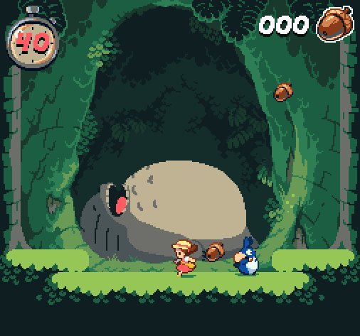

  
  <h2 align="center">🌸Welcome i'm Michele☕!</h2>

  
<h4>About me</h4>

  
|  | 👋 Hello! I'm on a journey to become a skilled developer through my technical degree in software development. Passionate about technology and philosophy, I explore the profound questions that shape our world. Let's connect at michelesantuss@gmail.com and explore the fascinating intersection of technology and philosophy! 🚀✨ |
|-------------------------------------------|--------------------------------------------------------------------------------------------------------------------------------------------------------------------------------------|

  
<h4>Socials</h4>

## 🌐 Socials:

  
<h4>Tech Stack</h4>

# 💻 Tech Stack:

       

  
<h4>GitHub Stats</h4>

# 📊 GitHub Stats:

<table>
  <tr>
    <td></td>
    <td></td>
  </tr>
</table>

<table>
  <tr>
    <td>
    <td></td>
  </tr>
</table>

  
<h4>Statistics</h4>

<a href="https://github.com/MicheleSaht">

<table>
  <tr>
    <td></td>
    <td></td>
  </tr>
</table>

<table>
  <tr>
    <td></td>
    <td></td>
  </tr>
</table>

<table>
  <tr>
    <td></td>
    <td></td>
  </tr>
</table>

  
<h4>⚡Activity Graph:</h4>

